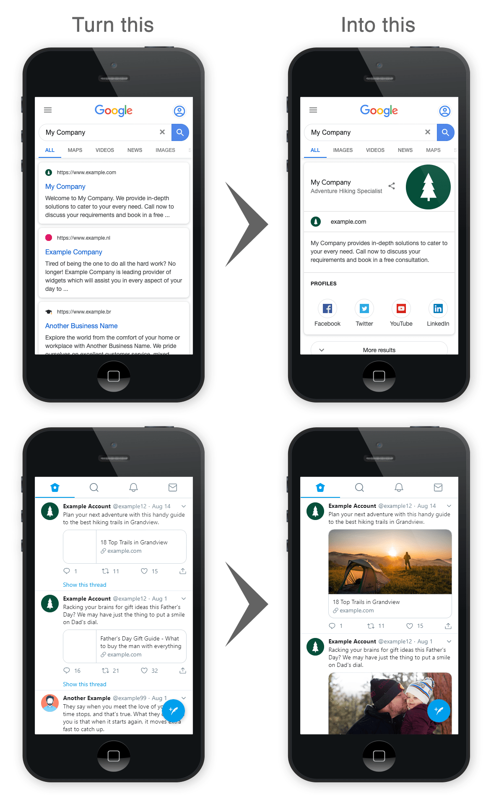

# Aura Plugin

The **Aura** Plugin for [Grav CMS](https://github.com/getgrav/grav) adds meta tags and structured data to your pages for visually appealing and informative search results and social media sharing.

## Features

* Minimal configuration required to automatically inject a wealth of structured/meta data into all pages of your site.
* Supports the following standards and protocols:
    * [Schema.org](https://schema.org/) structured data ld+json code snippet as used by major search providers Google, Microsoft, Yahoo! and Yandex 
    * [Open Graph](https://ogp.me/) meta tags as used by social platforms Facebook and Pinterest
    * [Twitter Card](https://developer.twitter.com/en/docs/tweets/optimize-with-cards/overview/abouts-cards.html) meta tags
    * [LinkedIn Article](https://www.linkedin.com/help/linkedin/answer/46687/making-your-website-shareable-on-linkedin?lang=en) meta tags

## Installation

### Admin Plugin

It is recommended to install Aura directly through the Admin Plugin by browsing to the `Plugins` tab and selecting `Add`.

**Important:** If upgrading from a version < 2.0.0 existing Aura metadata output will be disabled due to a change in the way the metadata is stored. You will not be required to re-enter any information, but you will need to actively re-save each page via the page editor to re-enable metadata output. The new method of saving metadata capitalises on Grav's inbuilt page caching for optimal site performance.

## Configuration

You can configure Aura via the Admin Plugin by browsing to `Plugins` and selecting `Aura`.

There are only two required fields to complete to get up and running: Organization Name and URL. However the more information you can provide, the richer your shared content will be.

## Usage

Global settings are configured at the plugin level as described above. These values are constant for each page of your site e.g. Organization name, logo and social account details.

There is an additional configuration tab titled `Aura` available on each page in the page editor. This is where to set page specific information such as the meta description. Other than meta description, data required at a page level (URL, title etc.) will be automatically inferred from Grav's internal system settings.

Additional metadata can also be entered on this tab. For example to signal to web crawlers not to index the page, enter key: `robots` and value: `noindex,nofollow`.

Individual Aura generated meta tags can be overridden with the Additional Metadata input as well. For example to display a specific title when sharing on Twitter only, enter a custom value for the key `twitter:title`.

## Credits

Big thanks to [Yoast](https://yoast.com/) for sharing their wealth of knowledge on structured data and SEO.
